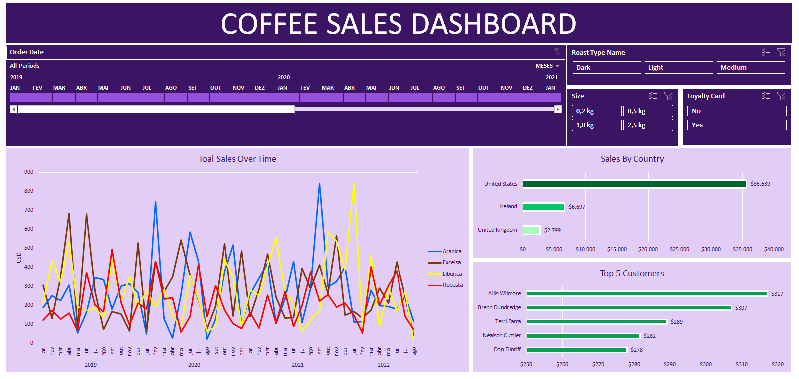

# ☕ Excel Project: Coffee Sales Dashboard

This project presents an interactive Excel dashboard designed to analyze coffee sales data across multiple regions. It encompasses data cleaning, transformation, and visualization techniques to extract meaningful business insights.

## 📊 Dashboard Overview

The dashboard provides insights into:

- **Total Sales Over Time**: Monthly sales trends across different coffee types.
- **Sales by Country**: Comparative analysis of sales in the United States, United Kingdom, and Ireland.
- **Top 5 Customers**: Identification of high-value customers based on total sales.
- **Product Performance**: Analysis of sales by coffee type and size.
- **Interactive Filters**: Slicers for coffee type, size, and loyalty card status, along with a timeline filter for date ranges.

## 🛠️ Tools & Technologies

- **Microsoft Excel**: Utilized for data cleaning, transformation, and dashboard creation.
- **Pivot Tables & Charts**: Employed for dynamic data summarization and visualization.
- **Excel Functions**: Implemented functions like `XLOOKUP`, `INDEX-MATCH`, and `IF` statements for data manipulation.
- **Slicers & Timelines**: Added for interactive data filtering.

## 📁 Project Structure

- `coffeeOrdersData.xlsx`: Contains the raw sales data.
- `coffeeOrdersProject.xlsx`: The main Excel file with the developed dashboard.
- `img/`: Directory containing images used in this repository.

## 📄 How to Use

1. **Download** the `coffeeOrdersProject.xlsx` file.
2. **Open** the file in Microsoft Excel (2016 or later recommended).
3. **Interact** with the dashboard using the provided slicers and timeline to filter data as needed.

---

*Developed by [Pedro Burini](https://github.com/pedroburini)*
